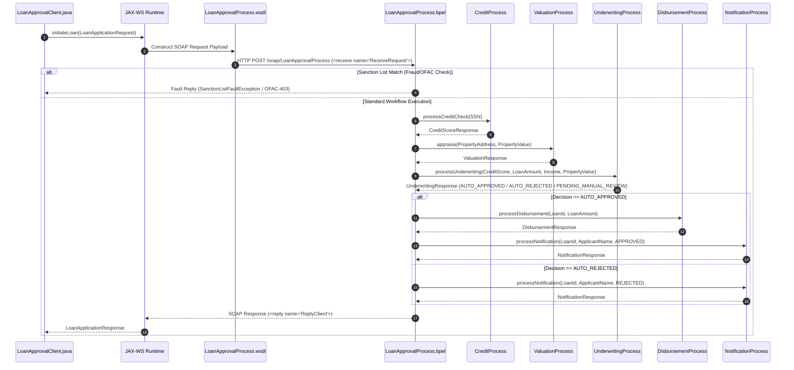

# Prompt Question : how the LoanApprovalClient.java accessing initiateLoan() functionlity provide step by step flow

# SOA Application Execution Flow: LoanApprovalClient.java & BPEL Orchestration

This document details the step-by-step end-to-end execution flow of how `LoanApprovalClient.java` invokes the `initiateLoan()` functionality, triggering the SOA Suite BPEL orchestration workflow and calling downstream microservices.

---

## 1. High-Level Architectural Sequence



---

## 2. Step-by-Step Execution Breakdown

### Step 1: JAX-WS Service & Proxy Initialization
In [`LoanApprovalClient.java`](file:///c:/ramu/Project_Assignment/RapidX/FreddeMac_Project_RapidX/Work/SOA_Example_Patterns_Research/Tarun_repo_Research/OSB_SOA_Suite_Ex5-main/OSB_SOA_Suite_Ex5-main_Tarun/java_clients/src/com/freddiemac/loanorchestration/clients/LoanApprovalClient.java#L24-L42), the client constructor initializes connection to the SOA Web Service using standard JAX-WS APIs:

- **Target WSDL Endpoint**: `http://localhost:8081/soap/LoanApprovalProcess?wsdl`
- **Target Namespace**: `http://xmlns.oracle.com/LoanOrchestration/LoanApprovalProcess`
- **Service Name**: `loanapproval_client_ep`
- **Binding Creation**:
  ```java
  URL wsdlURL = new URL(WSDL_URL);
  QName serviceName = new QName(NAMESPACE, SERVICE_NAME);
  Service service = Service.create(wsdlURL, serviceName);
  this.port = service.getPort(LoanApprovalProcessPort.class);
  ```
- **WSDL Mapping**: Connects to service bindings specified in [`LoanApprovalProcess.wsdl`](file:///c:/ramu/Project_Assignment/RapidX/FreddeMac_Project_RapidX/Work/SOA_Example_Patterns_Research/Tarun_repo_Research/OSB_SOA_Suite_Ex5-main/OSB_SOA_Suite_Ex5-main_Tarun/loan-service-soa/LoanApprovalProcess.wsdl#L49-L53).

---

### Step 2: Request Payload Construction
In [`LoanApprovalClient.java`](file:///c:/ramu/Project_Assignment/RapidX/FreddeMac_Project_RapidX/Work/SOA_Example_Patterns_Research/Tarun_repo_Research/OSB_SOA_Suite_Ex5-main/OSB_SOA_Suite_Ex5-main_Tarun/java_clients/src/com/freddiemac/loanorchestration/clients/LoanApprovalClient.java#L80-L87), the client instantiates a `LoanApplicationRequest` object containing applicant and loan parameters:

```java
LoanApplicationRequest request1 = new LoanApplicationRequest(
    "John Doe",           // applicantName
    "123-45-6789",        // ssn
    250000.0,             // loanAmount
    12000.0,              // monthlyIncome
    "123 Main St, VA",    // propertyAddress
    400000.0              // propertyValue
);
```

---

### Step 3: Invoking the `initiateLoan()` Operation
When calling [`client.initiateLoan(request)`](file:///c:/ramu/Project_Assignment/RapidX/FreddeMac_Project_RapidX/Work/SOA_Example_Patterns_Research/Tarun_repo_Research/OSB_SOA_Suite_Ex5-main/OSB_SOA_Suite_Ex5-main_Tarun/java_clients/src/com/freddiemac/loanorchestration/clients/LoanApprovalClient.java#L53-L64):

1. **Serialization**: JAX-WS runtime serializes the Java `LoanApplicationRequest` object into an XML SOAP Request envelope matching the schema defined in [`LoanWorkflow.xsd`](file:///c:/ramu/Project_Assignment/RapidX/FreddeMac_Project_RapidX/Work/SOA_Example_Patterns_Research/Tarun_repo_Research/OSB_SOA_Suite_Ex5-main/OSB_SOA_Suite_Ex5-main_Tarun/loan-service-soa/LoanWorkflow.xsd).
2. **HTTP Transmission**: Sends an HTTP POST SOAP message to `http://localhost:8081/soap/LoanApprovalProcess`.

---

### Step 4: BPEL Orchestration Workflow (`LoanApprovalProcess.bpel`)

The incoming SOAP request is received by the Oracle SOA Composite runtime executing [`LoanApprovalProcess.bpel`](file:///c:/ramu/Project_Assignment/RapidX/FreddeMac_Project_RapidX/Work/SOA_Example_Patterns_Research/Tarun_repo_Research/OSB_SOA_Suite_Ex5-main/OSB_SOA_Suite_Ex5-main_Tarun/loan-service-soa/LoanApprovalProcess.bpel):

#### 4.1 Entry Point (`<receive>`)
- **[BPEL Line 123](file:///c:/ramu/Project_Assignment/RapidX/FreddeMac_Project_RapidX/Work/SOA_Example_Patterns_Research/Tarun_repo_Research/OSB_SOA_Suite_Ex5-main/OSB_SOA_Suite_Ex5-main_Tarun/loan-service-soa/LoanApprovalProcess.bpel#L123)**: Accepts request via `<receive name="ReceiveRequest" operation="initiateLoan" variable="inputVar" createInstance="yes"/>`.

#### 4.2 Sanction Watchlist Exit Check
- **[BPEL Lines 126-146](file:///c:/ramu/Project_Assignment/RapidX/FreddeMac_Project_RapidX/Work/SOA_Example_Patterns_Research/Tarun_repo_Research/OSB_SOA_Suite_Ex5-main/OSB_SOA_Suite_Ex5-main_Tarun/loan-service-soa/LoanApprovalProcess.bpel#L126-L146)**: Checks if applicant name contains `'voldemort'` or SSN equals `'000-00-6666'`.
- If matched: Prepares `sanctionFaultVar` (`OFAC-403`), replies via `<reply name="ReplySanctionFault">`, and exits immediately. Client catches [`SanctionListFaultException`](file:///c:/ramu/Project_Assignment/RapidX/FreddeMac_Project_RapidX/Work/SOA_Example_Patterns_Research/Tarun_repo_Research/OSB_SOA_Suite_Ex5-main/OSB_SOA_Suite_Ex5-main_Tarun/java_clients/src/com/freddiemac/loanorchestration/clients/LoanApprovalClient.java#L106-L109).

#### 4.3 Credit Sub-composite Invocation
- **[BPEL Lines 149-159](file:///c:/ramu/Project_Assignment/RapidX/FreddeMac_Project_RapidX/Work/SOA_Example_Patterns_Research/Tarun_repo_Research/OSB_SOA_Suite_Ex5-main/OSB_SOA_Suite_Ex5-main_Tarun/loan-service-soa/LoanApprovalProcess.bpel#L149-L159)**: Copies SSN to `creditRequest` and invokes `CreditProcessRef` (`processCreditCheck`) to evaluate credit score.

#### 4.4 Valuation Sub-composite Invocation & Saga Compensation
- **[BPEL Lines 162-188](file:///c:/ramu/Project_Assignment/RapidX/FreddeMac_Project_RapidX/Work/SOA_Example_Patterns_Research/Tarun_repo_Research/OSB_SOA_Suite_Ex5-main/OSB_SOA_Suite_Ex5-main_Tarun/loan-service-soa/LoanApprovalProcess.bpel#L162-L188)**: Copies property address and property value to `valuationRequest` and calls `ValuationProcessRef` (`appraise`).
- Registers compensation handler (`ValuationScope`) to issue fee refund if downstream fraud is detected.

#### 4.5 Underwriting Sub-composite Invocation
- **[BPEL Lines 197-217](file:///c:/ramu/Project_Assignment/RapidX/FreddeMac_Project_RapidX/Work/SOA_Example_Patterns_Research/Tarun_repo_Research/OSB_SOA_Suite_Ex5-main/OSB_SOA_Suite_Ex5-main_Tarun/loan-service-soa/LoanApprovalProcess.bpel#L197-L217)**: Maps `creditScore`, `loanAmount`, `monthlyIncome`, and `propertyValue` into `underwritingRequest` and invokes `UnderwritingProcessRef` (`processUnderwriting`).

#### 4.6 Decision Routing & Final Processing
- **[BPEL Lines 219-338](file:///c:/ramu/Project_Assignment/RapidX/FreddeMac_Project_RapidX/Work/SOA_Example_Patterns_Research/Tarun_repo_Research/OSB_SOA_Suite_Ex5-main/OSB_SOA_Suite_Ex5-main_Tarun/loan-service-soa/LoanApprovalProcess.bpel#L219-L338)**:
  - **`AUTO_APPROVED` Branch**:
    1. Invokes `DisbursementProcessRef` (`processDisbursement`).
    2. Invokes `NotificationProcessRef` (`processNotification`).
    3. Sets status to `'DISBURSED'`.
  - **`AUTO_REJECTED` Branch**:
    1. Invokes `NotificationProcessRef` (`processNotification`) with decision `'REJECTED'`.
    2. Sets status to `'REJECTED'`.
  - **Manual Review Branch**:
    1. Sets status to `'PENDING_MANUAL_REVIEW'` for human workflow processing.

#### 4.7 Reply to Client
- **[BPEL Line 341](file:///c:/ramu/Project_Assignment/RapidX/FreddeMac_Project_RapidX/Work/SOA_Example_Patterns_Research/Tarun_repo_Research/OSB_SOA_Suite_Ex5-main/OSB_SOA_Suite_Ex5-main_Tarun/loan-service-soa/LoanApprovalProcess.bpel#L341)**: Sends `<reply name="ReplyClient" operation="initiateLoan" variable="outputVar"/>` back to caller.

---

### Step 5: Response Parsing in Java Client
1. JAX-WS framework deserializes the SOAP response body into a [`LoanApplicationResponse`](file:///c:/ramu/Project_Assignment/RapidX/FreddeMac_Project_RapidX/Work/SOA_Example_Patterns_Research/Tarun_repo_Research/OSB_SOA_Suite_Ex5-main/OSB_SOA_Suite_Ex5-main_Tarun/java_clients/src/com/freddiemac/loanorchestration/clients/LoanApprovalClient.java#L60-L63) object.
2. [`LoanApprovalClient.java`](file:///c:/ramu/Project_Assignment/RapidX/FreddeMac_Project_RapidX/Work/SOA_Example_Patterns_Research/Tarun_repo_Research/OSB_SOA_Suite_Ex5-main/OSB_SOA_Suite_Ex5-main_Tarun/java_clients/src/com/freddiemac/loanorchestration/clients/LoanApprovalClient.java#L118-L123) prints the outcome:
   - Loan ID
   - Status (`DISBURSED`, `REJECTED`, or `PENDING_MANUAL_REVIEW`)
   - Decision (`APPROVED`, `REJECTED`, or `PENDING`)
   - Decision Notes / Remarks

---

## 3. Requirement of `composite.xml` & `.bpel` Files in Sub-Modules

### Sub-Module Inventory
- `soa-credit-composite`
- `soa-valuation-composite`
- `soa-underwriting-composite`
- `soa-disbursement-composite`
- `soa-notification-composite`

### Architectural Analysis & Necessity

#### 1. Are these sub-modules participating in the flow?
**Yes, they are active participants.** 
The main orchestrator (`loan-service-soa/LoanApprovalProcess.bpel`) invokes each of these 5 sub-composites via SOAP Web Services:
- **Credit Sub-composite**: Invoked at [BPEL Line 157](file:///c:/ramu/Project_Assignment/RapidX/FreddeMac_Project_RapidX/Work/SOA_Example_Patterns_Research/Tarun_repo_Research/OSB_SOA_Suite_Ex5-main/OSB_SOA_Suite_Ex5-main_Tarun/loan-service-soa/LoanApprovalProcess.bpel#L157) (`CreditProcessRef`)
- **Valuation Sub-composite**: Invoked at [BPEL Line 186](file:///c:/ramu/Project_Assignment/RapidX/FreddeMac_Project_RapidX/Work/SOA_Example_Patterns_Research/Tarun_repo_Research/OSB_SOA_Suite_Ex5-main/OSB_SOA_Suite_Ex5-main_Tarun/loan-service-soa/LoanApprovalProcess.bpel#L186) (`ValuationProcessRef`)
- **Underwriting Sub-composite**: Invoked at [BPEL Line 216](file:///c:/ramu/Project_Assignment/RapidX/FreddeMac_Project_RapidX/Work/SOA_Example_Patterns_Research/Tarun_repo_Research/OSB_SOA_Suite_Ex5-main/OSB_SOA_Suite_Ex5-main_Tarun/loan-service-soa/LoanApprovalProcess.bpel#L216) (`UnderwritingProcessRef`)
- **Disbursement Sub-composite**: Invoked at [BPEL Line 235](file:///c:/ramu/Project_Assignment/RapidX/FreddeMac_Project_RapidX/Work/SOA_Example_Patterns_Research/Tarun_repo_Research/OSB_SOA_Suite_Ex5-main/OSB_SOA_Suite_Ex5-main_Tarun/loan-service-soa/LoanApprovalProcess.bpel#L235) (`DisbursementProcessRef`)
- **Notification Sub-composite**: Invoked at [BPEL Line 252](file:///c:/ramu/Project_Assignment/RapidX/FreddeMac_Project_RapidX/Work/SOA_Example_Patterns_Research/Tarun_repo_Research/OSB_SOA_Suite_Ex5-main/OSB_SOA_Suite_Ex5-main_Tarun/loan-service-soa/LoanApprovalProcess.bpel#L252) (`NotificationProcessRef`)

#### 2. Why `composite.xml` is required for each sub-module
In Oracle SCA (Service Component Architecture):
- **Deployment Unit Descriptor**: `composite.xml` is the mandatory deployment descriptor for an Oracle SOA deployment unit (`.jar`/`SAR` file). Without a `composite.xml`, WebLogic SOA Infrastructure cannot compile or deploy the sub-module.
- **Service Binding & Endpoint Mapping**: `composite.xml` defines the exposed SOAP service endpoint (e.g. `http://localhost:8082/soap/CreditProcess?wsdl`) so that external callers or the main orchestrator can invoke it over HTTP.
- **Component Wiring**: Wires the inbound SOAP service endpoint (`service`) to the internal BPEL implementation component (`component`).

#### 3. Why `.bpel` is required for each sub-module
- **Business Logic Execution**: The `.bpel` file (e.g., `soa-credit-composite/CreditProcess.bpel`) defines the execution logic for that specific micro-domain (e.g., credit check logic, appraisal valuation rules, underwriting evaluation).
- **Execution Engine**: When the main orchestrator calls `http://localhost:8082/soap/CreditProcess`, the WebLogic BPEL engine executes `CreditProcess.bpel` to evaluate the request and return the XML response.

#### 4. Summary Table: Component Requirements Across Modules

| Component / File | Needed in Main Orchestrator (`loan-service-soa`) | Needed in Sub-Modules (`soa-credit-composite`, etc.) | Purpose |
| :--- | :--- | :--- | :--- |
| **`LoanApprovalProcess.bpel`** | **Required** | Not Needed | Coordinates the entire parent workflow |
| **`LoanApprovalProcess.wsdl`** | **Required** | Not Needed | Entry contract for Java clients |
| **`CreditProcess.wsdl`** (and other sub WSDLs) | **Required** (Imported by reference) | **Required** | Contract interface binding caller to sub-service |
| **Sub-composite `composite.xml`** | Not Needed | **Required** | SCA deployment descriptor & endpoint binder for sub-composite |
| **Sub-composite `.bpel`** | Not Needed | **Required** | Implements the sub-composite domain workflow logic |

#### 5. Alternative Non-SOA Scenario
If those sub-services were implemented as non-SOA components (such as standalone **Java Spring Boot microservices**, **REST APIs**, or **Legacy EJBs**):
1. `soa-credit-composite`, `soa-valuation-composite`, etc. would **NOT need `composite.xml` or `.bpel` files**.
2. The main orchestrator (`loan-service-soa/composite.xml`) would only require their **WSDL/WADL contracts** or HTTP binding endpoints to call them as external services.

---

## 4. Final Confirmation: Removing Composite Files & Client Java Files

### Summary Verdict Table

| Component / Target Files | Can Be Removed? | Impact on `LoanApprovalClient.java` / `initiateLoan()` |
| :--- | :---: | :--- |
| **Sub-composite `composite.xml` & `.bpel` files**<br>(in `soa-credit-composite`, `soa-valuation-composite`, `soa-underwriting-composite`, `soa-disbursement-composite`, `soa-notification-composite`) | ❌ **NO** | **Runtime Failure**: Removes SOAP endpoints (`http://localhost:8082...`). `initiateLoan()` will fail with HTTP 404 / connection errors or `CreditServiceDownFault`. |
| **Individual Sub-Service Client Files**<br>([`CreditProcessClient.java`](file:///c:/ramu/Project_Assignment/RapidX/FreddeMac_Project_RapidX/Work/SOA_Example_Patterns_Research/Tarun_repo_Research/OSB_SOA_Suite_Ex5-main/OSB_SOA_Suite_Ex5-main_Tarun/java_clients/src/com/freddiemac/loanorchestration/clients/CreditProcessClient.java), [`DisbursementProcessClient.java`](file:///c:/ramu/Project_Assignment/RapidX/FreddeMac_Project_RapidX/Work/SOA_Example_Patterns_Research/Tarun_repo_Research/OSB_SOA_Suite_Ex5-main/OSB_SOA_Suite_Ex5-main_Tarun/java_clients/src/com/freddiemac/loanorchestration/clients/DisbursementProcessClient.java), [`NotificationProcessClient.java`](file:///c:/ramu/Project_Assignment/RapidX/FreddeMac_Project_RapidX/Work/SOA_Example_Patterns_Research/Tarun_repo_Research/OSB_SOA_Suite_Ex5-main/OSB_SOA_Suite_Ex5-main_Tarun/java_clients/src/com/freddiemac/loanorchestration/clients/NotificationProcessClient.java), [`UnderwritingProcessClient.java`](file:///c:/ramu/Project_Assignment/RapidX/FreddeMac_Project_RapidX/Work/SOA_Example_Patterns_Research/Tarun_repo_Research/OSB_SOA_Suite_Ex5-main/OSB_SOA_Suite_Ex5-main_Tarun/java_clients/src/com/freddiemac/loanorchestration/clients/UnderwritingProcessClient.java), [`ValuationProcessClient.java`](file:///c:/ramu/Project_Assignment/RapidX/FreddeMac_Project_RapidX/Work/SOA_Example_Patterns_Research/Tarun_repo_Research/OSB_SOA_Suite_Ex5-main/OSB_SOA_Suite_Ex5-main_Tarun/java_clients/src/com/freddiemac/loanorchestration/clients/ValuationProcessClient.java)) | ✅ **YES** | **No Impact**: `LoanApprovalClient.java` is completely self-contained and calls `LoanApprovalProcess.wsdl` directly. (*Note: Update [`ClientRunner.java`](file:///c:/ramu/Project_Assignment/RapidX/FreddeMac_Project_RapidX/Work/SOA_Example_Patterns_Research/Tarun_repo_Research/OSB_SOA_Suite_Ex5-main/OSB_SOA_Suite_Ex5-main_Tarun/java_clients/src/com/freddiemac/loanorchestration/clients/ClientRunner.java) if removing them*). |

---

### Detailed Analysis for Final Confirmation

#### 1. Why `composite.xml` and `.bpel` CANNOT be removed from sub-modules
1. **Deployment Unit Requirement**: In Oracle SOA Suite, `composite.xml` defines the deployment unit and exposes the Web Service binding.
2. **Runtime Endpoint Absence**: `LoanApprovalProcess.bpel` calls these endpoints dynamically via SOAP Web Services. If the `composite.xml` and `.bpel` files are removed, WebLogic cannot host these HTTP SOAP endpoints, causing the orchestrator to fail during `initiateLoan()`.

#### 2. Why sub-service `*Client.java` files CAN be removed
1. **No Code Dependency**: [`LoanApprovalClient.java`](file:///c:/ramu/Project_Assignment/RapidX/FreddeMac_Project_RapidX/Work/SOA_Example_Patterns_Research/Tarun_repo_Research/OSB_SOA_Suite_Ex5-main/OSB_SOA_Suite_Ex5-main_Tarun/java_clients/src/com/freddiemac/loanorchestration/clients/LoanApprovalClient.java) does not import or call any of the individual client Java files.
2. **Purpose of Sub-Clients**: They exist solely as isolated unit test classes for testing individual composite services directly without triggering the full orchestrator.

---

## 5. Architectural Clarification: Java Client Layer vs. SOA Suite Runtime Layer

### 1. From the Perspective of `LoanApprovalClient.java` (Java Client Layer)
* **Direct Target**: `LoanApprovalClient.java` **only connects to ONE endpoint**: `http://localhost:8081/soap/LoanApprovalProcess`.
* **Zero Direct Dependency**: `LoanApprovalClient.java` has **no direct knowledge or dependency** on `soa-credit-composite/composite.xml`, `CreditProcess.bpel`, or any sub-composite files. It does not compile, load, or parse them.

### 2. From the Perspective of Oracle SOA Suite (Infrastructure Layer)
* **Hosting & Partner Connections**: The sub-composites' `composite.xml` and `.bpel` files are **strictly required by Oracle SOA Suite** so that WebLogic SOA Infrastructure can:
  1. **Deploy & Host** the downstream sub-services on ports `8082`, `8083`, `8084`, `8085`, and `8086`.
  2. **Establish partner link connections** when `LoanApprovalProcess.bpel` invokes them during runtime orchestration.

### Layer-by-Layer Dependency Matrix

```
┌─────────────────────────────────────────────────────────────────────────────┐
│                       JAVA CLIENT LAYER                                     │
│  LoanApprovalClient.java                                                    │
│  ├── Knows ONLY: LoanApprovalProcess.wsdl (Port 8081)                       │
│  └── Does NOT know/care about sub-composite composite.xml or .bpel files    │
└──────────────────────────────────┬──────────────────────────────────────────┘
                                   │ HTTP SOAP Request
                                   ▼
┌─────────────────────────────────────────────────────────────────────────────┐
│                    ORACLE SOA SUITE INFRASTRUCTURE                          │
│                                                                             │
│  Main Composite: loan-service-soa                                           │
│  └── LoanApprovalProcess.bpel                                               │
│            │                                                                │
│            ├── Partner Call (Port 8082) ──► Requires soa-credit-composite   │
│            │                                  (composite.xml + .bpel)       │
│            ├── Partner Call (Port 8083) ──► Requires soa-valuation-composite│
│            │                                  (composite.xml + .bpel)       │
│            ├── Partner Call (Port 8084) ──► Requires soa-underwriting-comp  │
│            │                                  (composite.xml + .bpel)       │
│            ├── Partner Call (Port 8085) ──► Requires soa-disbursement-comp │
│            │                                  (composite.xml + .bpel)       │
│            └── Partner Call (Port 8086) ──► Requires soa-notification-comp  │
│                                               (composite.xml + .bpel)       │
└─────────────────────────────────────────────────────────────────────────────┘
```

### Responsibility Matrix

| Component | Required by `LoanApprovalClient.java`? | Required by Oracle SOA Suite? |
| :--- | :---: | :---: |
| `LoanApprovalProcess.wsdl` | **YES** | **YES** |
| Main `loan-service-soa` (`composite.xml` & `.bpel`) | **NO** (Client only sends HTTP request) | **YES** |
| Sub-composite `composite.xml` & `.bpel` files (`soa-credit-composite`, etc.) | ❌ **NO** | ✅ **YES** (To deploy sub-services and establish BPEL partner links) |
